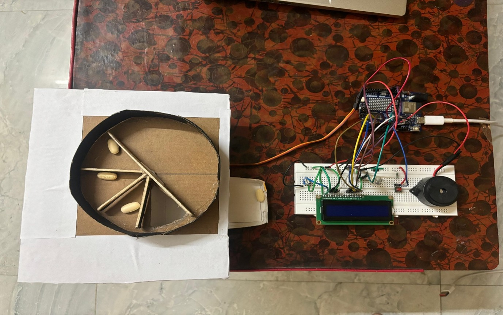
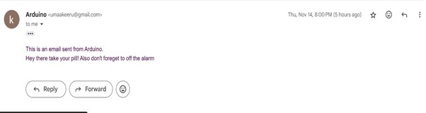

# 💊 Automatic Pill Dispenser using Arduino

An Arduino-powered smart medication dispenser that ensures timely and accurate pill dispensing with multiple reminder systems. The system uses a servo motor to dispense pills, an LCD to display status, a buzzer for audio alerts, and Wi-Fi connectivity to send email notifications.

> 🎓 **Pre-Final Year Summer Project**
> 🏫 Madras Institute of Technology, Anna University  
> 🗓️ August – December 2024

---

## ✅ Features

- Automated pill dispensing using a servo motor
- LCD display showing time and device status
- Real-time alerts via buzzer and email
- Email notifications sent using SMTP over Wi-Fi
- Manual control using push button
- Easily customizable schedule and rotation angle

---

## 🧰 Components Used

| Component              | Description                                      |
|------------------------|--------------------------------------------------|
| Arduino UNO R4 Wi-Fi   | Main microcontroller with built-in Wi-Fi        |
| SG90 Servo Motor       | Used to rotate and dispense pills               |
| 1602 LCD Display       | Shows time, dose status, and alerts             |
| Active Buzzer          | Audio alerts for dose reminders                 |
| Push Button            | Manual override and interaction                 |
| Potentiometer          | Adjusts LCD contrast                            |
| RTC Library            | Maintains time for scheduling                   |
| Wi-Fi + SMTP Library   | Sends email notifications to users/caregivers   |

---

## 💻 Software & Libraries

- [Arduino IDE](https://www.arduino.cc/en/software)
- `Servo.h` – Servo motor control  
- `LiquidCrystal.h` – LCD interface  
- `RTC.h` – Real-time clock library  
- `WiFiS3.h` – Wi-Fi connectivity for Arduino UNO R4  
- `ESP_Mail_Client.h` – Sending emails via SMTP

---

## 📁 Folder Structure
```
automatic-pill-dispenser/
├── pill_dispenser.ino # Arduino source code
├── README.md # Project documentation
├── PillDispenser_Report.pdf # Final report (converted from DOCX)
├── images/ # Folder for screenshots and circuit photos
│ ├── circuit_diagram.jpg
│ ├── pill_demo.jpg
│ └── mail_screenshot.jpg
```
## 🛠️ How to Use

1. Clone this repository.
2. Open `pill_dispenser.ino` in Arduino IDE.
3. Replace the following in code:
   - `WIFI_SSID` and `WIFI_PASSWORD`
   - `SENDER_EMAIL` and `SENDER_PASSWORD` (use Google App Password)
   - `RECIPIENT_EMAIL`
4. Upload the code to your Arduino UNO R4 Wi-Fi board.
5. Power the device and monitor LCD for current time and alerts.
6. Watch for scheduled dispensing and check email for notifications.

---

## 📷 Images



*Circuit Setup of the dispenser*


*Email sent from Arduino at scheduled time*

---
## 📄 Report

📘 [View Final Project Report (PDF)](./PillDispenser_Report.pdf)

---

## 👨‍🔧 Project Contributors

- **Keerthana U** – 2022504024  
- **Yuvaraj V** – 2022504554  
- **Abishek P** – 2022504552  

**Guide:** 
Dr. K. Mariammal  
Associate Professor,  
Department of Electronics Engineering,  
MIT Campus, Anna University, Chennai.

---

## 📚 References

- [Science Buddies - Pill Dispenser](https://www.sciencebuddies.org/science-fair-projects/project-ideas/Elec_p105/electricity-electronics/automatic-pill-dispenser)
- [Arduino Email Tutorial](https://newbiely.com/tutorials/arduino-uno-r4/arduino-uno-r4-email)
- [ESP Mail Client GitHub](https://github.com/mobizt/ESP-Mail-Client)

---

## ⚠️ Disclaimer

This project was developed for academic purposes. It is not a certified medical device. Use with caution and at your own risk.
